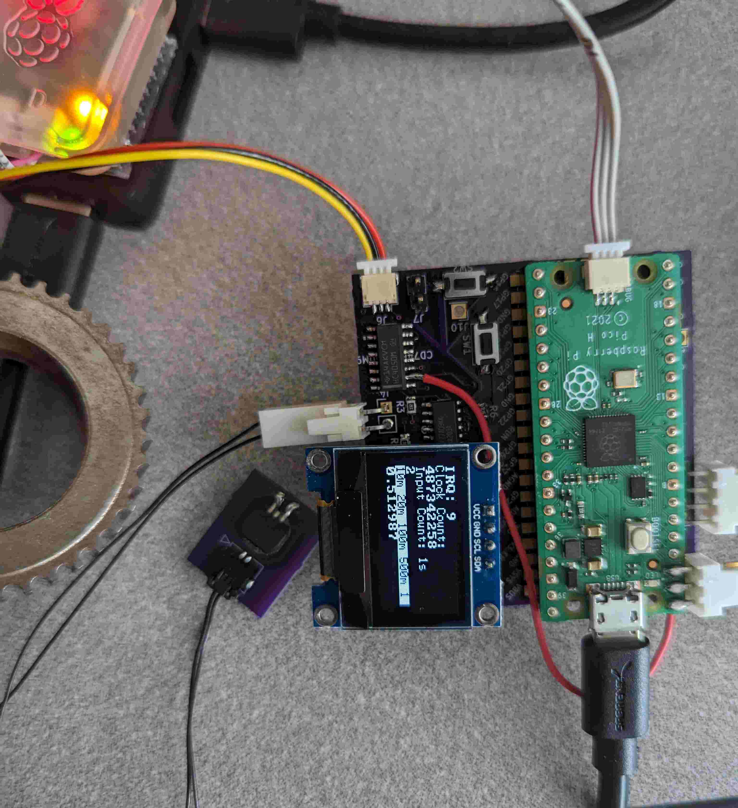

# Reciprocal frequency counter for Raspberry pi pico

Shield: [![CC BY-SA 4.0][cc-by-sa-shield]][cc-by-sa]

This work is licensed under a
[Creative Commons Attribution-ShareAlike 4.0 International License][cc-by-sa].

[![CC BY-SA 4.0][cc-by-sa-image]][cc-by-sa]

[cc-by-sa]: http://creativecommons.org/licenses/by-sa/4.0/
[cc-by-sa-image]: https://licensebuttons.net/l/by-sa/4.0/88x31.png
[cc-by-sa-shield]: https://img.shields.io/badge/License-CC%20BY--SA%204.0-lightgrey.svg

## Citation
[Rrciprocal frequency counter](https://forums.raspberrypi.com/viewtopic.php?t=306250)
 The guts of the "pio" code was copied from this thread, and slightly modified and translated from "micropython"
 Display stuff, and PCB is my own.

## Main project
[The counter](pico_display_oled/main.cpp)

## Circuit board
[kicad board](kicad_pico_counter_new)

## Background
- Wanted to make a speed sensor to detect gear teeth for some application. Did not need to use a "Reciprocal frequency counter" and / or such
a complicated "pio" setup, but decided to go down this route anyway.

- Picked a part from "Allegro microsystems" to do the sensing. There was no "Development board" available, but this should be just as good :)

- "ATS19480: Large Air Gap, GMR Speed Sensor IC for Gear Tooth Sensing" is the part. Should be available on Digikey or Mouser.

## Features
- Circuit board has a "driver" to read from a 2 terminal device. Window comparator added to translate discrete states of current, to 3.3 IO voltage.
This is for compatibility with GPIO on the pico board.

- Have had success using the sensor to read from the position 

- Button to change the window size

- Reset button (the pico board should have had this from the get go)

- Button to switch between sensor input, and input from 50ohm source (function generator)

## Brag
Was able to conveniently run from the 5V usb powe source, with no additional boos converter.

## Awesome script to install sdk on Ubuntu 23.04
[install script](notes/install_raspberry_pico.sh) 

# Notes
Some other junk is included in this project (interfacing with other sensors), feel free to ignore. Also other "Scratch" projects included

sudo minicom -D /dev/ttyACM0 -b 115200  

Also examples from [pimoroni C examples](https://github.com/pimoroni/pimoroni-pico/tree/main/examples)  
how to setup IDE [Pico + cLion](https://forums.raspberrypi.com/viewtopic.php?t=310446)  

